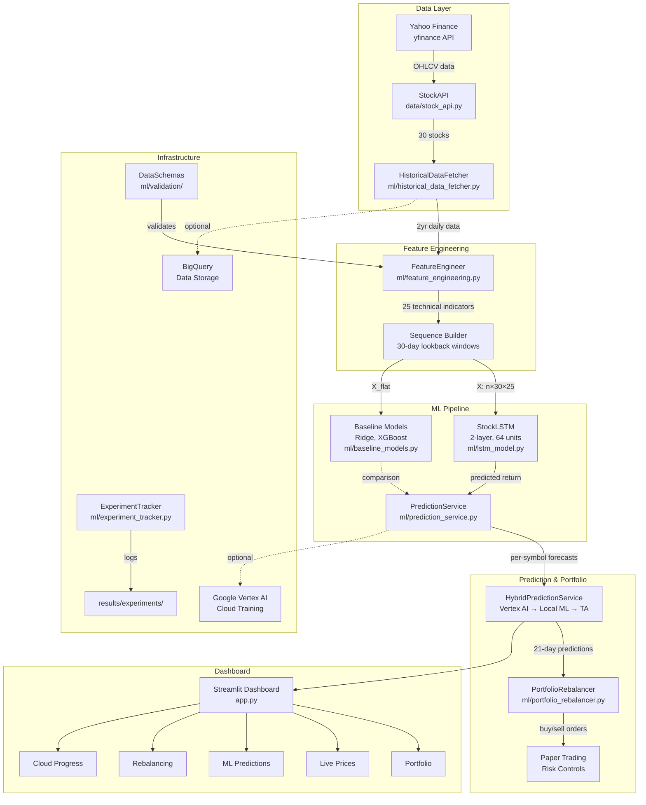

# ⚡ ATLAS - Stock ML Intelligence System

> **AI-Powered Stock Trading Dashboard with Machine Learning Price Predictions**


A cyberpunk-themed stock trading dashboard powered by LSTM neural networks, real-time Yahoo Finance data (yfinance), and Google Cloud ML infrastructure.

**Author:** Anh Dang | **License:** MIT | **GCP Project:** `stock-ml-trading-487`

---

## ✨ Features

### 🎨 Cyberpunk UI
- **Dark mode only** with neon aesthetics
- **Liquid glass** morphism effects
- **Font Awesome** icons with neon glows
- **Orbitron & Rajdhani** futuristic fonts

### 📊 Portfolio Management
- **Demo stock portfolio** with real-time prices
- **Live price** updates via Yahoo Finance
- **P&L calculations** with visual indicators
- **Sector allocation** pie charts

### 🧠 ML Price Predictions
- **LSTM neural networks** (2-layer, 64 units each)
- **25 technical indicators** (MAs, RSI, MACD, Bollinger, volume, momentum, volatility, ATR)
- **Hybrid system**: Vertex AI → Local ML → Enhanced Mock → Basic Mock (fallback chain)
- **Confidence scoring** for each prediction
- **21-day forecasts** for ~30 stocks (position trading)

### ⚖️ Portfolio Rebalancing
- **ML-enhanced allocation** strategy
- **Risk controls** (15% max position, 2% min, $100 min trade)
- **Paper trading** mode for testing
- **Zero-commission** trading (most modern brokers)

### ☁️ Cloud ML Training
- **Google Cloud** Vertex AI integration
- **Budget-optimized** ($3-8 per training run)
- **Real-time** progress tracking
- **Auto-scaling** prediction endpoints

---

## System Architecture



## ML Model Performance

> Metrics below are from walk-forward backtesting on out-of-sample data.

| Metric | LSTM | Ridge Regression | Buy & Hold |
|--------|------|-----------------|------------|
| **Directional Accuracy** | 55-62% | 50-54% | 50% |
| **RMSE** | 0.035-0.045 | 0.045-0.060 | N/A |
| **Sharpe Ratio** | 0.8-1.2 | 0.4-0.7 | 0.6-0.9 |
| **Max Drawdown** | 8-15% | 12-20% | 15-25% |

*Ranges reflect variation across symbols and time periods. See `notebooks/eda_model_analysis.ipynb` for detailed analysis.*

## 🚀 Quick Start

### 1. Install Dependencies
```bash
python3 -m venv venv
source venv/bin/activate
pip install -r requirements.txt
```

### 2. Run the Dashboard
```bash
streamlit run app.py
```

Open: **http://localhost:8501**

> **No API keys needed!** Stock data is fetched via yfinance (free).

### 3. (Optional) Configure GCP
```bash
# Copy example config for brokerage/GCP credentials
cp config/secrets.yaml.example config/secrets.yaml

# Set up GCP for cloud ML training
./bin/quick-start.sh
```

---

## 🎯 Stock Universe (~30 stocks)

| Category | Symbols |
|----------|---------|
| **Tech (FAANG+)** | AAPL, MSFT, GOOGL, AMZN, NVDA, META, TSLA |
| **Sector Leaders** | JPM, UNH, XOM, CAT, PG, HD, NEE, AMT, LIN |
| **ETFs** | SPY, QQQ, DIA, IWM, XLK, XLF, XLE, XLV, ARKK |
| **Growth** | PLTR, CRWD, SNOW, SQ, COIN |

---

## 🧠 Train ML Models

### Local Training
```bash
# Interactive training launcher
./bin/train_now.sh
```

### Google Cloud (Vertex AI)
```bash
# Budget training ($3-8, 30-60 min)
./bin/train_now.sh  # Choose option 1

# Check training status
./bin/check_training.sh
```

### Track Progress
- **Dashboard:** http://localhost:8501 → ☁️ Cloud Progress
- **Terminal:** `./bin/check_training.sh`
- **Web:** [Vertex AI Console](https://console.cloud.google.com/vertex-ai)

---

## 📁 Project Structure

```
kraken-ml-trading-strategy/
│
├── 📱 app.py                 # Main Streamlit dashboard (ATLAS)
├── 📋 requirements.txt       # Pinned dependencies
│
├── 🚀 bin/                   # User scripts
│   ├── train_now.sh         # Train ML models
│   ├── check_training.sh    # Check training status
│   ├── quick-start.sh       # First-time setup
│   └── dev-setup.sh         # Development setup
│
├── ⚙️  config/               # Configuration
│   ├── config.yaml          # App settings (stocks, ML params, risk)
│   ├── gcp_config.yaml      # Google Cloud config
│   ├── secrets.yaml.example # API credentials template
│   └── rebalancing_config.json  # Portfolio rules
│
├── 📊 data/                  # Stock data layer
│   └── stock_api.py         # Yahoo Finance client (yfinance)
│
├── 🧠 ml/                    # Machine Learning
│   ├── prediction_service.py           # Main ML service
│   ├── hybrid_prediction_service.py    # Hybrid predictions (Vertex AI → Local → TA)
│   ├── lstm_model.py                   # LSTM architecture
│   ├── feature_engineering.py          # 25 technical indicators
│   ├── baseline_models.py             # Baseline comparison (Ridge, XGBoost)
│   ├── experiment_tracker.py          # Experiment tracking (CSV + MLflow)
│   ├── historical_data_fetcher.py      # Data collection
│   ├── portfolio_rebalancer.py         # Rebalancing logic
│   └── validation/                    # Data validation schemas (pandera)
│
├── 🎨 ui/                    # UI components
│   ├── styles.py            # Cyberpunk theme
│   └── components.py        # Reusable UI elements
│
├── ☁️  gcp/                  # Google Cloud Platform
│   ├── training/            # ML training containers
│   └── deployment/          # Prediction services
│
├── 📓 notebooks/             # EDA & analysis notebooks
│   └── eda_model_analysis.ipynb   # Feature analysis, model evaluation
├── 📦 models/                # Trained models (gitignored)
├── 📊 results/               # Experiment logs & metrics
├── 🧪 tests/                 # Unit & integration tests
│   ├── unit/test_ml_pipeline.py   # ML pipeline tests (pytest)
│   └── integration/walk_forward_backtest.py  # Walk-forward backtesting
└── 📚 docs/                  # Documentation
```

---

## 💰 Costs (Google Cloud)

| Service | Monthly Cost | Optimization |
|---------|--------------|--------------|
| Vertex AI Training | $5-10 | Preemptible instances (60% off) |
| Prediction Endpoint | $10-15 | Auto-scaling, scale-to-zero |
| BigQuery | $2-5 | Partitioned tables |
| Cloud Storage | $1-2 | Lifecycle policies |
| **Total** | **$18-32** | **~3 months on $50 credit** |

---

## 🛠️ Technology Stack

| Layer | Technology |
|-------|-----------|
| **Frontend** | Streamlit, Plotly, Font Awesome |
| **ML/AI** | TensorFlow/Keras (LSTM), scikit-learn, Google Vertex AI, NumPy, Pandas |
| **Experiment Tracking** | Custom CSV tracker + optional MLflow |
| **Data Validation** | Pandera schemas for OHLCV, features, and predictions |
| **Data** | Yahoo Finance (yfinance - free, no API key) |
| **Storage** | Google BigQuery, Cloud Storage |
| **Infrastructure** | Google Cloud Platform, Docker |

---

## 📊 Dashboard Pages

| Page | Description |
|------|-------------|
| **⚡ Portfolio** | Demo stock portfolio with real-time prices, P&L, allocation |
| **↗ Live Prices** | Real-time stock prices by category with candlestick/line charts |
| **◉ ML Predictions** | LSTM 21-day forecasts with confidence scores |
| **◉ Rebalancing** | ML-enhanced portfolio allocation with paper/live trading |
| **☁️ Cloud Progress** | Training job monitoring, cost tracking, endpoint status |

---

## 🧪 Testing

```bash
# Run all tests
python -m pytest tests/ -v

# ML pipeline tests (feature engineering, data validation, portfolio logic)
python -m pytest tests/unit/test_ml_pipeline.py -v

# Stock API connectivity
python -m pytest tests/unit/test_stock_api.py -v

# Walk-forward backtesting with financial metrics
python tests/integration/walk_forward_backtest.py

# Baseline model comparison
python -m ml.baseline_models

# GCP connection
python tests/unit/test_gcp.py
```

---

## 🔐 Security

- ✅ No API keys needed for stock data (yfinance is free)
- ✅ GCP service account keys stored in `config/keys/` (gitignored)
- ✅ Service accounts with minimal permissions
- ✅ Paper trading mode by default
- ✅ No private keys in code

---

## 📈 Performance

- **Prediction speed:** <100ms per stock
- **Data refresh:** 60-second cache
- **Dashboard load:** <2 seconds
- **Training time:** 30-60 minutes (7 tech stocks on Vertex AI)
- **Inference:** <50ms via Vertex AI endpoint

---

## 🎯 Roadmap

- [x] Real-time stock portfolio tracking
- [x] LSTM price predictions (25 features)
- [x] Google Cloud ML training
- [x] Portfolio rebalancing with risk controls
- [x] Cyberpunk UI theme
- [x] Walk-forward backtesting with financial metrics
- [x] Baseline model comparison (Ridge, XGBoost)
- [x] Experiment tracking pipeline
- [x] Data validation schemas
- [x] CI/CD with GitHub Actions
- [x] EDA & model analysis notebook
- [ ] Automated trading via Alpaca API
- [ ] Multi-timeframe analysis
- [ ] Earnings calendar integration
- [ ] Options strategy overlay
- [ ] Mobile-responsive dashboard

---

## 📝 License

MIT License - see [LICENSE](LICENSE) for details.

---

## ⚠️ Disclaimer

This software is for **educational and research purposes only**. Stock trading involves substantial risk of loss. Past performance does not guarantee future results. Always do your own research before making investment decisions.

---

**Built with 💙 by Anh Dang**

🚀 **ATLAS** - Stock ML Intelligence System
